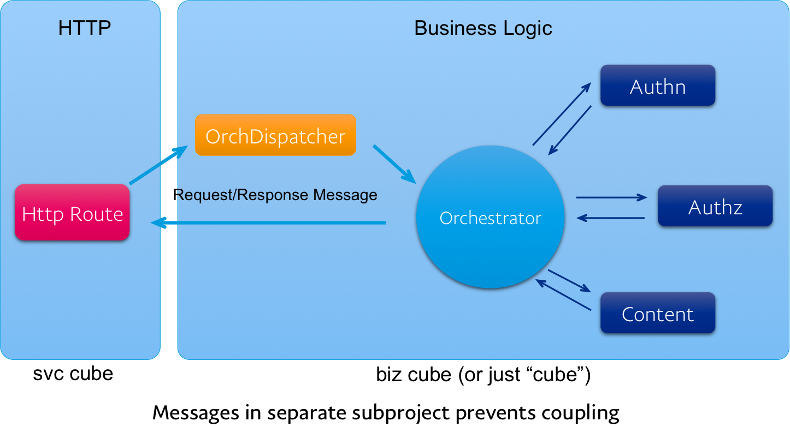
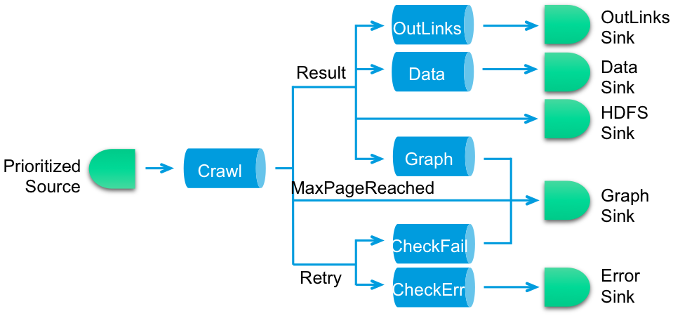

##squbs Training - Your first Async Orchestrator

###Get the squbs template application up and running:
1. Create a squbs mid-tier service in Altus
2. Clone the newly created repo
3. Open app in IntelliJ
4. Note: Depending on bandwidth, this may need time
5. Open sbt window
6. Run `extractConfig dev` from sbt window to populate config
7. Configure `run` in IntelliJ - add AspectJ config
   * Click down button and choose “Edit Configurations"
   * Click the `+` sign
   * Choose `application`
   * Name: `runapp`
   * Main class: `org.squbs.unicomplex.Bootstrap`
   * VM options: `-javaagent:/Users/asucharitakul/.ivy2/cache/org.aspectj/aspectjweaver/jars/aspectjweaver-1.8.5.jar`
   * Working directory: `…/{project}servsvc`
   * Use classpath of module: `{project}svc`
   * Before launch: … box click `-` to remove `make` and click `+` to choose `SBT`. Select action `compile`
   * Click `OK`
8. Run the app by pressing the start button with the right arrow
9. Check the app and registered context
   * Point your browser to `http://localhost:8080/admin/v3console/ValidateInternals`
   * Choose the `Component Status` tab
   * Select the link `org.squbs.unicomplex…::Listeners`
   * See the app registered to Default Listener
10. Point your browser to `http://localhost:8080/{service}serv/hello`
11. See squbs in action.
12. Stop the app.
13. Run the app from sbt
   * Go to sbt window
   * `project {project}svc`
   * `~re-start` (The `~` is telling sbt to re-run that command every time a change is detected, like `~compile` would recompile every time a file changes
14. Make a modification to the app.
   * Edit the RouteDefinition file *Svc.scala
   * Change service name to “My Service”
   * Save
15. Watch sbt re-starting your app
16. Stop the app in sbt
   * `re-stop`

###Architecture of Simple Orchestration App:


###Create messages for the mock services:

1. In the cube project, create `src/main/scala` if not exists
2. Create a new Scala class: MockServices.scala
   * Right click on the `src/main/scala` directory in the project pane
   * Select `new` -> `Scala Class`
   * Enter class name with package: `com.paypal.myorg.{project}.cube.MockServices`
3. Implement all the request/response types to the mock service before and outside any class:

   ```scala
   case class AuthRequest(user: String, password: String)
   case class AuthResponse(token: Try[String])
   case class RoleRequest(user: String)
   case class RoleResponse(role: Try[String])
   case class ContentRequest(token: String, role: String, resource: String)
   case class ContentResponse(content: String)
   ```
   Note IntelliJ may suggest certain imports. Accept the suggestions. Sometimes there are multiple choices. For `Try` import `scala.util.Try`.

###Create and register actors mocking the services to call
1. In the same file, remove the `MockService` class and enter the mock actors:
   * AuthNActor
   
   ```scala
   class AuthNActor extends Actor with ActorLogging {

     def receive = {
       case AuthRequest(user, password) =>
         log.info("Got authn request for user {}, letting it pass", user)
         sender() ! AuthResponse(Success("justarandomtoken"))
     }
   }
   ```
     
   * AuthZActor
   
   ```scala
   class AuthZActor extends Actor with ActorLogging {

     def receive = {
       case RoleRequest(user) =>
         log.info("Got role request from user {}, answering with 'admin'", user)
         sender() ! RoleResponse(Success("admin"))
     }
   }
   ```

   * ContentActor
   
   ```scala
   class ContentActor extends Actor with ActorLogging {

     def receive = {
       case ContentRequest(token, role, resource) =>
         log.info("Got content request token: {}, role: {}, resource: {}, sending some mock content")
         sender() ! ContentResponse("Hello, this is some mock content")
     }
   }
   ```
   
2. Register the services and input/output types. Note: Registering the input/output types are optional. This registration tells squbs to start your actors for you. Registering the types allows squbs ActorRegistry to find actors by input and output type. 

   Open file `squbs-meta.conf` in the cube project and replace it to be the followings:

  ```
  cube-name = com.paypal.myorg.{project}servcube
  cube-version = "0.0.1-SNAPSHOT"
  squbs-actors = [
    {
      class-name = com.paypal.myorg.{project}serv.cube.AuthNActor
      name = authNActor
      message-class = [
        {
          request = com.paypal.myorg.{project}serv.cube.AuthRequest
          response = com.paypal.myorg.{project}serv.cube.AuthResponse
        }
      ]
    }
    {
      class-name = com.paypal.myorg.{project}serv.cube.AuthZActor
      name = authZActor
      message-class = [
        {
          request = com.paypal.myorg.{project}serv.cube.RoleRequest
          response = com.paypal.myorg.{project}serv.cube.RoleResponse
        }
      ]
    }
    {
      class-name = com.paypal.myorg.{project}serv.cube.ContentActor
      name = contentActor
      message-class = [
        {
          request = com.paypal.myorg.{project}serv.cube.ContentRequest
          response = com.paypal.myorg.{project}serv.cube.ContentResponse
        }
      ]
    }
  ]
  ```

###Create the orchestration messages
In the {project}msgs project, create new case class OrchestrationRequest/OrchestrationResponse. This is for service to send request/response to the orchestrator logic.

1. If the `src/main/scala` does not exist, create the directory by right-clicking on `src/main` in the project pane, select `New`->`Directory` and name the directory `scala`.
2. Right click on the `scala` directory and create a new Scala class by selecting `New`->`Scala Class`. Then name the class `com.paypal.myorg.{project}serv.msgs.OrchestrationMessages`.
3. Enter the following content in the class.

   ```scala
   case class OrchestrationRequest(user: String, password: String, resource: String)
   case class OrchestrationResponse(role: String, content: String)
   ```

4. Also create a few known exception cases:

   ```scala
   case class AuthenticationFailed(msg: String) extends Exception(msg)
   case class AuthorizationFailed(msg: String) extends Exception(msg)
   case class InvalidResource(msg: String) extends Exception(msg)
   case class OrchestrationTimeout(msg: String) extends Exception(msg)
   ```


###Create the orchestrator actor and dispatcher
The orchestration actor is a short-lived actor that only lives one request as it contains the request's intermediate state. Services can create the orchestration actor at will. But to provide through loose coupling from http service and be able to call it from any kind of client, be it messages or otherwise, we front the orchestrator with a long-living dispatcher.

1. Edit the `build.sbt` file in `{project}servcube` project and add dependencies to `squbs-pattern` and `squbs-actorregistry` The dependencies will look like below. When saving, IntelliJ will prompt for refreshing the project. Click `Refresh project` on the top of the editor. This may take some time depending on bandwidth.

   ```scala
   libraryDependencies ++= Seq(
     "com.typesafe.akka" %% "akka-actor" % akkaV,
     "com.typesafe.akka" %% "akka-slf4j" % akkaV,
     "org.squbs" %% "squbs-unicomplex" % squbsV,
     "org.squbs" %% "squbs-pattern" % squbsV,
     "org.squbs" %% "squbs-actorregistry" % squbsV,
     "com.ebay.squbs" %% "rocksqubs-kernel" % squbsV,
     "org.scalatest" %% "scalatest" % "2.2.1" % "test",
     "com.typesafe.akka" %% "akka-testkit" % akkaV % "test",
     "org.squbs" %% "squbs-testkit" % squbsV % "test"
   )
   ```
   
2. Create a new Scala class ContentOrchestrator.scala in the `{project}servcube` project.
   * Right click on the `src/main/scala` directory in the project pane
   * Select `new` -> `Scala Class`
   * Enter class name with package: `com.paypal.myorg.{project}.cube.Orchestrator`

3. Create the ContentOrchestrator actor and `import context.system` as we need to use the `ActorSystem` as context for many calls.

   ```scala
   class ContentOrchestrator extends Orchestrator {
     import context.system
   
   }
   ```
   **Note**: We'll implement the ContentOrchestrator from bottom to top, a bit backwards as to not have any dependency issues.
4. Create the request/response functions to call the mock services. Add these functions to the `ContentOrchestrator` class.
 
   ```scala
     def authenticate(user: String, password: String): OFuture[String] = {
       val p = OPromise[String]
       ActorLookup ! AuthRequest(user, password)
       expectOnce {
         case AuthResponse(token) => p.complete(token)
       }
       p.future
     }

     def authorize(user: String): OFuture[String] = {
       val p = OPromise[String]
       ActorLookup ! RoleRequest(user)
       expectOnce {
         case RoleResponse(role) => p.complete(role)
       }
       p.future
     }

     def fetchContent(token: String, role: String, resource: String): OFuture[String] = {
       val p = OPromise[String]
       ActorLookup ! ContentRequest(token, role, resource)
       expectOnce {
         case ContentResponse(content) => p.complete(content)
       }
       p.future
     }
   ```
   
5. Implement the orchestrate function and orchestration logic. The orchestrate function is the key orchestration logic and is usually placed above the request/response functions.

   ```scala
     def orchestrate(request: OrchestrationRequest, requester: ActorRef): Unit = {
       import request._
       val tokenF = authenticate(user, password)
       val roleF = authorize(user)
       val contentF = (tokenF, roleF) >> fetchContent(resource)

       // Happy path
       for {
         role <- roleF
         content <- contentF
       } {
         requester ! OrchestrationResponse(role, content)

         context.stop(self)
       }
       ...
   ```
   
6. Also take care of the not so happy paths:

   ```scala
       ...
       // Not so happy cases
       tokenF onFailure {
         case e: Throwable =>
           requester ! Status.Failure(e)
           context.stop(self)
       }

       roleF onFailure {
         case e: Throwable =>
           requester ! Status.Failure(e)
           context.stop(self)
       }

       contentF onFailure {
         case e: Throwable =>
           requester ! Status.Failure(e)
           context.stop(self)
       }
       ...
   ```

7. Don't forget to handle timeouts properly, too. But before we do that, we need to import a couple of utilities at the top of the file:

   ```scala
   import scala.concurrent.duration._
   import scala.language.postfixOps
   ```
   
   Now we continue with the rest of the orchestrate function:
   
   ```scala
       import context.dispatcher
       val timeout = Timeout(50 milliseconds)
       context.system.scheduler.scheduleOnce(timeout.duration, self, timeout)
       expectOnce {
         case Timeout(duration) =>
           val checks = Seq(tokenF -> "token", roleF -> "role", contentF -> "content")
           val message = checks.collect {
             case (future: Future[_], name: String) if !future.isCompleted => name
           } .mkString("Timed out waiting for: [", ",", s"] after $duration")
           requester ! Status.Failure(OrchestrationTimeout(message))
       }
     }   
   ```
   
8. Expect initial orchestration request. This code is to be put ahead of the orchestration function in the ContentOrchestrator class.

   ```scala
     expectOnce {
       case request: OrchestrationRequest => orchestrate(request, sender())
     }
   ```
   
   
9. Create the ContentOrchestrator dispatcher. Remember, the ContentOrchestrator is a single use actor. It gets created per request. So we need to implement the dispatcher:

   ```scala
   class Dispatcher extends Actor {
     def receive = {
       case request: OrchestrationRequest => context.actorOf(Props[ContentOrchestrator]) forward request
     }
   }
   ```
   
10. Last, we need to register the dispatcher. Edit `squbs-meta.conf` of the cube project and add the following actor registration:

   ```
     {
       class-name = com.paypal.myorg.{project}serv.cube.Dispatcher
       name = contentOrchestrator
       message-class = [
         {
           request = com.paypal.myorg.{project}serv.msgs.OrchestrationRequest
           response = com.paypal.myorg.{project}serv.msgs.OrchestrationResponse
         }
       ]
     }
   ```

###Modify the Http service to call the orchestrator
1. Open the route class `{Project}servSvcIn` the `{projce}servsvc` project.
2. If there is a `Mediator` actor in the source, remove it.
3. Add the following directives to the route. This will route a request with `http://localhost:8080/{project}serv/content/foo?user=sombody&pass=somepass` to the orchestrator:

   ```scala
   ~
    path("content" / Segment) { resource =>
      get {
        parameters('user.as[String], 'pass.as[String]) { (user, pass) =>
          onComplete(ActorLookup ? OrchestrationRequest(user, pass, resource)) {
            case Success(OrchestrationResponse(role, content)) => complete(content)
            case Failure(AuthenticationFailed(msg)) =>
              complete(StatusCodes.Unauthorized, msg)
            case Failure(AuthorizationFailed(msg)) =>
              complete(StatusCodes.Unauthorized, msg)
            case Failure(InvalidResource(msg)) =>
              complete(StatusCodes.NotFound, msg)
            case Failure(OrchestrationTimeout(msg)) =>
              complete(StatusCodes.RequestTimeout, msg)
            case Failure(e: AskTimeoutException) =>
              complete(StatusCodes.RequestTimeout, e.getMessage)
            case Failure(e) => complete(StatusCodes.InternalServerError, e.getMessage)
            case _ => complete(StatusCodes.InternalServerError, "Unknown error")          }
        }
      }
    }
   ```
   
   These directives will match the path and parameters, call the orchestrator asynchronously, and interpret the response from the orchestrator into HTTP status codes.

###Run the project
1. Re-run your project and test with the following URL from your browser: `http://localhost:8080/{project}serv/content/foo?user=sombody&pass=somepass`
2. Optional, add time delays to authentication or authorization actors and see the timeout behavior as well as the asynchronous behavior through logging, as in the example below:

   ```scala
   class AuthZActor extends Actor with ActorLogging {

     def receive = {
       case RoleRequest(user) =>
         log.info("Got role request from user {}, answering with 'admin'", user)
         import context.dispatcher
         context.system.scheduler.scheduleOnce(300 milliseconds, sender(), RoleResponse(Success("admin")))
     }
   }

   ```
   
   **NOTE**: It is a **crime** to call Thread.sleep in this architecture. It blocks the thread and brings your application to a crawl instantaneously. If you need to make sure something happens in the future, use the system scheduler. This can be accessed from an actor through `context.system.scheduler`. 


###Perpetual Streams
Another pattern squbs formally supports is the Perpetual Stream pattern using the Akka Streams technology. Messages can be sent into streams from http or other messaging systems such as Kafka. Streams may be used to transform messages, route messages, or even make service calls to enrich the messages on the stream.

We won't be able to cover perpetual streams more than giving an glimpse today.

For instance, here is an actual application's stream flow and corresponding streams definition:



```scala
prioritizeSource ~> crawlerFlow ~> bCast0 ~> result ~> bCast ~> outLinksFlow ~> outLinksSink
                                                       bCast ~> dataSinkFlow ~> dataSink
                                                       bCast ~>                 hdfsWriteSink
                                                       bCast ~> graphFlow    ~>    graphMerge ~> graphSink
                                   bCast0 ~> maxPage             ~>                graphMerge
                                   bCast0 ~> retry ~> bCastRetry ~> retryFailed ~> graphMerge                                                        bCastRetry ~> errorSink
```

